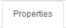

=== TestCase

==== TestCase List

image:testcaselistpage.png[TestCaseListPage]

==== Test Case attributes
|=== 

| *Field* | *Description*  

| Test Folder | *[red]#Test Folder#* name on which test case belong.

| Test case | An ID (alphanumeric character) that identify the *[red]#Test Case#* inside the *[red]#Test Folder#*.

| Short Description | Provide a brief description of the *[red]#Test Case#*.

| Application | The application for which the test case is defined.

| Status | Used to implement a workflow and gives way to filter *[red]#Test Case#* depending on its implementation status.

| Active | Boolean that defines if the *[red]#Test Case#* can be launched.

| Type | define the technology of the application (Web, IOS, Android, service,...).

| Priority | Defined the priority of the *[red]#Test Case#*. Means importance of the feature covered by the *[red]#Test Case#*.

| Detailed Description | Provide more detailed information about the *[red]#Test Case#*.

|=== 

The Activation Criterias defines condition to enable/block the Testcase to be launched in specific context (countries, environment...). This level of specification is the most important (override all the others conditions)

A Test case can be linked to multiple Labels depending on their assigned system (see labels section)

You can define Robot constrains at test case level in order to force the execution a specific test case with a specific UserAgent or ScreenSize.
This is used to test some specific behavior of a website for a given UserAgent or ScreenSize.
You can tune the list of UserAgent and ScreenSize proposed in autocomplete mode (on the GUI) by modifying the respective public invariant USERAGENT and SCREENSIZE.

UserAgent and ScreenSize will be defined at execution level following the rule :

|=== 

| *TestCase* | *Robot / Execution* | *UserAgent Result*   
| UserAgent1 |	| UserAgent1
|  | UserAgent2 | UserAgent2
|  |	| user Agent unchanged
| UserAgent1 | UserAgent2 | UserAgent1

|=== 

|=== 

| *TestCase* | *Robot / Execution* | *ScreenSize Result*   
| 1024*768 |	| 1024*768
|  | 640*360 | 640*360
|  |	| Fullscreen
| 1024*768 | 640*360 | 1024*768

|=== 

=== Test Case Step

==== Step

. Click on *[red]#Add step#* to display the following window.  image:testcasepage.png[TestCasePage,250,250,float="right",align="center"] 
. Feed a *[red]#Description#* and click on *[red]#Add#* for a new step. 
. Or search for a step in library then click on *[red]#Add#*.

image:testcaseaddstep.png[testcaseaddstep]

Your step is created. if you want to put it in library, just click on the book on the right side.
A step in library will be available to add it in all test cases of your current system.

image:testcasesteplibrary.png[testcasesteplibrary]

In the following screenshot you can see a use step. This step is imported from the previous library step.
You are not able to modify it (all fields are grey). But you can find a link at the top to open the library if you want to modify your step. All use steps from this library will be impacted by your modification.

To modify only this use step, you have to click on the padlock icon but it will not be a use step anymore. (modification on library step will not affect it)

image:testcaseusestep.png[testcaseusestep]

NOTE: You have the possibility to switch the position of your steps by drag and drop the 3 dots.

image:testcasemovestep1.png[testcaseusestep] image:testcasemovestep2.png[testcaseusestep]

NOTE: It is possible to loop over a step using the following configuration.
image:testlooptep.png[TestCaseLoopStep]

=== TestCase Action

==== Unknown 
Unknown action. Should be used when the action is not yet known. 
Warning: make the execution fail. 
 
==== click 
Click on the left mouse button on an _element_ inside the current page.

*[blue]#Value1#*	Identifier and name of the element to click in the form of : identifier=html_reference.

==== longPress 
Click during a specific duration on the left mouse button on an _element_ inside the current page.

*[blue]#Value1#*	Identifier and name of the element to click in the form of : identifier=html_reference.

*[blue]#Value2#*	Duration of the click in milliseconds.

==== mouseLeftButtonPress
Press and keep the left mouse button pressed on an _element_ until the action 'mouseLeftButtonRelease' is executed. 

*[blue]#Value1#*	Identifier and name of the element to click in the form of : identifier=html_reference.

==== mouseLeftButtonRelease
Release the mouse button on an __element__. 
Usefull with ButtonPress to perform drag & drop 

*[blue]#Value1#*	Identifier and name of the element where release will be done in the form of : identifier=html_reference.

==== doubleClick 
Double click on an _element_ inside the current page.

*[blue]#Value1#*	Identifier and name of the element to click in the form of : identifier=html_reference.

==== rightClick 
Right click on an element inside the current page. 

*[blue]#Value1#*	Identifier and name of the element to double click in the form of : identifier=html_reference. 

==== mouseOver
Mouse cursor over an _element_ inside the current page.

*[blue]#Value1#*	Identifier and name of the element to over in the form of : identifier=html_reference.

==== focustoIframe
Set the focus to a specific frame on the current page.

*[blue]#Value1#*	Identifier and name of the frame to focus in the form of : identifier=html_reference.

==== focustoDefaultIframe
Set back the focus to the previous frame on the current page.

==== switchToWindow
Switch the focus to another window (like popup dialog).

*[blue]#Value1#*	Title or URL of the other window to switch to.

.By Tittle
====
title=titleOfThisNewWindow
====

.By Tittle
====
url=http://url_of_this_new_window
====

==== manageDialog
Close the browser popup alert windows either by accepting it with `ok` either by cancelling it with `cancel`

*[blue]#Value1#*	`ok` or `cancel`

==== manageDialogKeypress 
Keypress inside the browser popup alert windows.

*[blue]#Value1#*	List of characters to type. You can use several special keys into the same action

.Normal test
====
texttoenter[ENTER]
====

.Normal test and special keys
====
user[TAB]password[ENTER]
====
    

[NOTE]
====
Supported keys are : [BACK_SPACE], [TAB], [RETURN], [ENTER], [SHIFT], [LEFT_SHIFT], [CONTROL], [LEFT_CONTROL], [ALT], [LEFT_ALT], [ESCAPE], [SPACE], [PAGE_UP], [PAGE_DOWN], [LEFT], [ARROW_LEFT], [UP], [ARROW_UP], [RIGHT], [ARROW_RIGHT], [DOWN], [ARROW_DOWN], [DELETE], [SEMICOLON], [EQUALS], [NUMPAD0], [NUMPAD1], [NUMPAD2], [NUMPAD3], [NUMPAD4], [NUMPAD5], [NUMPAD6], [NUMPAD7], [NUMPAD8], [NUMPAD9], [MULTIPLY], [ADD], [SEPARATOR], [SUBTRACT], [DECIMAL], [DIVIDE], [F1], [F2], [F3], [F4], [F5], [F6], [F7], [F8], [F9], [F10], [F11], [F12]
====

==== OpenUrlWithBase
OpenUrl action using the base defined in the application / environment section.

*[blue]#Value1#*	Relative URL to open.

.relative URL
====
/cerberustesting/page.html
====

==== OpenUrlLogin
OpenUrl action using the login page defined at application / environment level.

==== OpenUrl
Open a specified full url.

*[blue]#Value1#*	Complete URL to open.

.Title
====
https://github.com
====

==== refreshCurrentPage
Reload the current page.

==== executeJS
|=== 

| *[green]#GUI#* | *[red]#SRV#* | *[red]#APK#* | *[red]#IPA#* | *[red]#FAT#* | *[red]#BAT#*

|=== 
Execute a JS script (no output can be retrieved).

*[blue]#Value1#*	Javascript to execute.

.Javascript
====
    var newOption = new Option('%property.ApplicationName%', '%property.ApplicationName%', true, true);
    $('#application').append(newOption).trigger('change');
====

==== executeCommand
|=== 

| *[red]#GUI#* | *[red]#SRV#* | *[green]#APK#* | *[green]#IPA#* | *[red]#FAT#* | *[red]#BAT#*

|=== 
Execute a Command on the robot side. You can follow the Appium instructions http://appium.io/docs/en/commands/mobile-command/[here].

*[blue]#Value1#*	Command to execute. Ex : mobile:deepLink

*[blue]#Value2#*	Arguments of the command. Ex : {url: "https://www.site.com/", package: "com.site.SomeAndroidPackage"}

==== executeCerberusCommand
|=== 

| *[green]#GUI#* | *[green]#SRV#* | *[green]#APK#* | *[green]#IPA#* | *[green]#FAT#* | *[green]#BAT#*

|=== 
Execute a Command from the Cerberus Server side. The command will be executed using the user defined in the parameter `cerberus_executeCerberusCommand_user`, password defined in `cerberus_executeCerberusCommand_password` and script from the path `cerberus_executeCerberusCommand_path` 

*[blue]#Value1#*	Command to execute.

==== openApp
|=== 

| *[green]#GUI#* | *[red]#SRV#* | *[green]#APK#* | *[green]#IPA#* | *[green]#FAT#* | *[red]#BAT#*

|=== 
Open an Application. For *[green]#GUI#* and *[green]#FAT#*, this action require the Cerberus Sikuli extention.

*[blue]#Value1#*	Application to Open. BundleId for *[green]#IPA#* (activateApp() method is used), if empty, launchApp() method is used). App Package for *[green]#APK#* ('am start' command is used).  

*[blue]#Value2#*	App Activity for *[green]#APK#*.

==== closeApp
|=== 

| *[red]#GUI#* | *[red]#SRV#* | *[green]#APK#* | *[green]#IPA#* | *[red]#FAT#* | *[red]#BAT#*

|=== 
Close an application.

*[blue]#Value1#*	Application to Open.

==== dragAndDrop
|=== 

| *[green]#GUI#* | *[red]#SRV#* | *[red]#APK#* | *[red]#IPA#* | *[red]#FAT#* | *[red]#BAT#*

|=== 
Will Drag from an _Element_ to another __Element__.

*[blue]#Value1#*	Identifier and name of the element to drag in the form of : identifier=html_reference.

*[blue]#Value2#*	Identifier and name of the element where to drop in the form of : identifier=html_reference..

==== select
|=== 

| *[green]#GUI#* | *[red]#SRV#* | *[green]#APK#* | *[green]#IPA#* | *[red]#FAT#* | *[red]#BAT#*

|=== 
Select an option in a <select> Element. this 'text' must be defined : <option value="text">. For APK and IPA, action only works in a web mode.

*[blue]#Value1#*	Identifier and name of the element of the select in the form of : identifier=html_reference.

*[blue]#Value2#*	Element to select.

.Title
====
<option value="text">
====

==== keypress
|=== 

| *[green]#GUI#* | *[red]#SRV#* | *[green]#APK#* | *[green]#IPA#* | *[green]#FAT#* | *[red]#BAT#*

|=== 
will allow you to press any key in the current web page.

*[blue]#Value1#* : Identifier and name of the element where the key is pressed in the form of : identifier=html_reference.

*[blue]#Value2#* : Keycode of the key to press.

.for a GUI application
====
ENTER
====
.for a FAT application
====
Key.ENTER
====

The keycodes (see. keypress action) also changes depending on the application type (GUI, IPA, APK or FAT). The syntaxes are:

- for GUI : `KEYNAME`

Following Selenium `KEYNAME` can be used : NULL, CANCEL, HELP, BACK_SPACE, TAB, CLEAR, RETURN, ENTER, SHIFT, LEFT_SHIFT, CONTROL, LEFT_CONTROL, ALT, LEFT_ALT, PAUSE, ESCAPE, SPACE, PAGE_UP, PAGE_DOWN, END, HOME, LEFT, ARROW_LEFT, UP, ARROW_UP, RIGHT, ARROW_RIGHT, DOWN, ARROW_DOWN, INSERT, DELETE, SEMICOLON, EQUALS, NUMPAD0, NUMPAD1, NUMPAD2, NUMPAD3, NUMPAD4, NUMPAD5, NUMPAD6, NUMPAD7, NUMPAD8, NUMPAD9, MULTIPLY, ADD, SEPARATOR, SUBTRACT, DECIMAL, DIVIDE, F1, F2, F3, F4, F5, F6, F7, F8, F9, F10, F11, F12, META, COMMAND, ZENKAKU_HANKAKU

- for APK : `KEYNAME`

Following Appium Android `KEYNAME` can be used : UNKNOWN, SOFT_LEFT, SOFT_RIGHT, HOME, BACK, CALL, ENDCALL, DIGIT_0, DIGIT_1, DIGIT_2, DIGIT_3, DIGIT_4, DIGIT_5, DIGIT_6, DIGIT_7, DIGIT_8, DIGIT_9, STAR, POUND, DPAD_UP, DPAD_DOWN, DPAD_LEFT, DPAD_RIGHT, DPAD_CENTER, VOLUME_UP, VOLUME_DOWN, POWER, CAMERA, CLEAR, A, B, C, D, E, F, G, H, I, J, K, L, M, N, O, P, Q, R, S, T, U, V, W, X, Y, Z, COMMA, PERIOD, ALT_LEFT, ALT_RIGHT, SHIFT_LEFT, SHIFT_RIGHT, TAB, SPACE, SYM, EXPLORER, ENVELOPE, ENTER, DEL, GRAVE, MINUS, EQUALS, LEFT_BRACKET, RIGHT_BRACKET, BACKSLASH, SEMICOLON, APOSTROPHE, SLASH, AT, NUM, HEADSETHOOK, FOCUS, PLUS, MENU, NOTIFICATION, SEARCH, MEDIA_PLAY_PAUSE, MEDIA_STOP, MEDIA_NEXT, MEDIA_PREVIOUS, MEDIA_REWIND, MEDIA_FAST_FORWARD, MUTE, PAGE_UP, PAGE_DOWN, PICTSYMBOLS, SWITCH_CHARSET, BUTTON_A, BUTTON_B, BUTTON_C, BUTTON_X, BUTTON_Y, BUTTON_Z, BUTTON_L1, BUTTON_R1, BUTTON_L2, BUTTON_R2, BUTTON_THUMBL, BUTTON_THUMBR, BUTTON_START, BUTTON_SELECT, BUTTON_MODE, ESCAPE, FORWARD_DEL, CTRL_LEFT, CTRL_RIGHT, CAPS_LOCK, SCROLL_LOCK, META_LEFT, META_RIGHT, FUNCTION, SYSRQ, BREAK, MOVE_HOME, MOVE_END, INSERT, FORWARD, MEDIA_PLAY, MEDIA_PAUSE, MEDIA_CLOSE, MEDIA_EJECT, MEDIA_RECORD, F1, F2, F3, F4, F5, F6, F7, F8, F9, F10, F11, F12, NUM_LOCK, NUMPAD_0, NUMPAD_1, NUMPAD_2, NUMPAD_3, NUMPAD_4, NUMPAD_5, NUMPAD_6, NUMPAD_7, NUMPAD_8, NUMPAD_9, NUMPAD_DIVIDE, NUMPAD_MULTIPLY, NUMPAD_SUBTRACT, NUMPAD_ADD, NUMPAD_DOT, NUMPAD_COMMA, NUMPAD_ENTER, NUMPAD_EQUALS, NUMPAD_LEFT_PAREN, NUMPAD_RIGHT_PAREN, VOLUME_MUTE, INFO, CHANNEL_UP, CHANNEL_DOWN, KEYCODE_ZOOM_IN, KEYCODE_ZOOM_OUT, TV, WINDOW, GUIDE, DVR, BOOKMARK, CAPTIONS, SETTINGS, TV_POWER, TV_INPUT, STB_POWER, STB_INPUT, AVR_POWER, AVR_INPUT, PROG_RED, PROG_GREEN, PROG_YELLOW, PROG_BLUE, APP_SWITCH, BUTTON_1, BUTTON_2, BUTTON_3, BUTTON_4, BUTTON_5, BUTTON_6, BUTTON_7, BUTTON_8, BUTTON_9, BUTTON_10, BUTTON_11, BUTTON_12, BUTTON_13, BUTTON_14, BUTTON_15, BUTTON_16, LANGUAGE_SWITCH, MANNER_MODE, MODE_3D, CONTACTS, CALENDAR, MUSIC, CALCULATOR, ZENKAKU_HANKAKU, EISU, MUHENKAN, HENKAN, KATAKANA_HIRAGANA, YEN, RO, KANA, ASSIST, BRIGHTNESS_DOWN, BRIGHTNESS_UP, MEDIA_AUDIO_TRACK, SLEEP, WAKEUP, PAIRING, _MEDIA_TOP_MENU, KEY_11, KEY_12, LAST_CHANNEL, TV_DATA_SERVICE, VOICE_ASSIST, TV_RADIO_SERVICE, TV_TELETEXT, TV_NUMBER_ENTRY, TV_TERRESTRIAL_ANALOG, TV_TERRESTRIAL_DIGITAL, TV_SATELLITE, TV_SATELLITE_BS, TV_SATELLITE_CS, TV_SATELLITE_SERVICE, TV_NETWORK, TV_ANTENNA_CABLE, TV_INPUT_HDMI_1, TV_INPUT_HDMI_2, TV_INPUT_HDMI_3, TV_INPUT_HDMI_4, TV_INPUT_COMPOSITE_1, TV_INPUT_COMPOSITE_2, TV_INPUT_COMPONENT_1, TV_INPUT_COMPONENT_2, TV_INPUT_VGA_1, TV_AUDIO_DESCRIPTION, TV_AUDIO_DESCRIPTION_MIX_UP, TV_AUDIO_DESCRIPTION_MIX_DOWN, TV_ZOOM_MODE, TV_CONTENTS_MENU, _TV_MEDIA_CONTEXT_MENU, TV_TIMER_PROGRAMMING, HELP, NAVIGATE_PREVIOUS, NAVIGATE_NEXT, NAVIGATE_IN, NAVIGATE_OUT, STEM_PRIMARY, STEM_1, STEM_2, STEM_3, DPAD_UP_LEFT, DPAD_DOWN_LEFT, DPAD_UP_RIGHT, DPAD_DOWN_RIGHT, MEDIA_SKIP_FORWARD, MEDIA_SKIP_BACKWARD, MEDIA_STEP_FORWARD, MEDIA_STEP_BACKWARD, SOFT_SLEEP, CUT, COPY, PASTE

- for IPA : `KEYNAME`

Following Appium IOS `KEYNAME` can be used : RETURN, ENTER, SEARCH, BACKSPACE

- for FAT : `Key.KEYNAME`

Following KEYNAME values can be used : ENTER, TAB, ESC, BACKSPACE, DELETE, INSERT, SPACE, F1, F2, F3, F4, F5, F6, F7, F8, F9, F10, F11, F12, F13, F14, F15, HOME, END, LEFT, RIGHT, DOWN, UP, PAGE_DOWN, PAGE_UP, PRINTSCREEN, PAUSE, CAPS_LOCK, SCROLL_LOCK, NUM_LOCK, NUM0, NUM1, NUM2, NUM3, NUM4, NUM5, NUM6, NUM7, NUM8, NUM9, SEPARATOR, ADD, MINUS, MULTIPLY, DIVIDE, ALT, CMD, CTRL, META, SHIFT, WIN

==== type
|=== 

| *[green]#GUI#* | *[red]#SRV#* | *[green]#APK#* | *[green]#IPA#* | *[green]#FAT#* | *[red]#BAT#*

|=== 
Type a data in an Element.

*[blue]#Value1#* : Identifier and name of the element where the data is entered in the form of : identifier=html_reference.

*[blue]#Value2#* : data to enter in the field.

==== clearField
|=== 

| *[red]#GUI#* | *[red]#SRV#* | *[green]#APK#* | *[green]#IPA#* | *[red]#FAT#* | *[red]#BAT#*

|=== 
Clear (Empty) an Element.

*[blue]#Value1#* : Identifier and name of the element to be cleared in the form of : identifier=html_reference.

==== hidekeyboard
|=== 

| *[red]#GUI#* | *[red]#SRV#* | *[green]#APK#* | *[green]#IPA#* | *[red]#FAT#* | *[red]#BAT#*

|=== 
Hide the currently visible keyboard

==== swipe
|=== 

| *[red]#GUI#* | *[red]#SRV#* | *[green]#APK#* | *[green]#IPA#* | *[red]#FAT#* | *[red]#BAT#*

|=== 
The action simulates a user pressing down on the screen, sliding to another position, and removing their finger from the screen. Swipe action can be used neither with unique parameter *[red]#UP#*, *[red]#DOWN#*, *[red]#LEFT#* or *[red]#RIGHT#* or with combination of parameter *[red]#CUSTOM#* and *[red]#x1;y1;x2;y2#*, which are coordinates of origin point (x1;y1) and *relatives* coordinates of destination point (x2;y2)

*[blue]#Value1#* : *[red]#UP#*, *[red]#DOWN#*, *[red]#LEFT#*, *[red]#RIGHT#* or *[red]#CUSTOM#*.

*[blue]#Value2#* : *[red]#x1;y1;x2;y2#* (only used if *Value1* is *[red]#CUSTOM#*)

.Swipe Up
====
*[blue]#Value1#* UP

*[blue]#Value2#* 

will swipe from the 2/3 to the 1/3 of the screen.
====

.Custom Swipe
====
*[blue]#Value1#* CUSTOM

*[blue]#Value2#* 100;100;0;100

Will swipe from the point (100;100) to the point (100;200)
====

==== scrollTo
|=== 

| *[green]#GUI#* | *[red]#SRV#* | *[green]#APK#* | *[green]#IPA#* | *[red]#FAT#* | *[red]#BAT#*

|=== 
Scroll to either an element or a text.

*[blue]#Value1#* : Identifier and name of the element where the scroll will move the screen to in the form of : identifier=html_reference.

*[blue]#Value2#* : text in the screen where the scroll will move.

[NOTE]
====
Use either Value1 or Value2. If both are feed, the Value2 scroll will be used first.
====

==== installApp
|=== 

| *[red]#GUI#* | *[red]#SRV#* | *[green]#APK#* | *[green]#IPA#* | *[red]#FAT#* | *[red]#BAT#*

|=== 
Install an application on the mobile.

*[blue]#Value1#* : Path to the application to install.

.Title
====
/root/toto.apk
====

==== removeApp
|=== 

| *[red]#GUI#* | *[red]#SRV#* | *[green]#APK#* | *[green]#IPA#* | *[red]#FAT#* | *[red]#BAT#*

|=== 
Remove an application from the mobile.

*[blue]#Value1#* : Application package name to remove.

.Title
====
com.cerberus.appmobile
====

==== wait
|=== 

| *[green]#GUI#* | *[green]#SRV#* | *[green]#APK#* | *[green]#IPA#* | *[green]#FAT#* | *[green]#BAT#*

|=== 
Wait for a certain amount of time or for an element to be present on a page.

*[blue]#Value1#* : Either an integer that represent a duration in ms, either an Element that we will wait to exist in the form of : identifier=html_reference.

.Title
====
10000

Will wait 10 seconds
====

.Title
====
id=userName

Will wait that element with id equal to userName is loaded on the current screen.
====

==== waitVanish
|=== 

| *[green]#GUI#* | *[red]#SRV#* | *[green]#APK#* | *[green]#IPA#* | *[green]#FAT#* | *[red]#BAT#*

|=== 
Wait that an element is removed from the page.

*[blue]#Value1#* : Element that we will wait to be removed from the screen in the form of : identifier=html_reference.

.Title
====
id=userName

Will wait that Element with id equal to userName is removed from the current screen.
====

==== waitNetworkTrafficIdle
|=== 

| *[green]#GUI#* | *[red]#SRV#* | *[green]#APK#* | *[green]#IPA#* | *[green]#FAT#* | *[red]#BAT#*

|=== 
Wait that network traffic idle. Cerberus will wait until requests are no longer performed. That can be used in order to secure that all page components are fully loaded and does not miss some important resource hits. In order to do so, Cerberus will check periodically the number of hits generated from the application since the beginning of the test case. When the number of hits stops to grow during that period, Cerberus stop waiting and continue the test case.

Parameter 'cerberus_networkstatsave_idleperiod_ms' can be used to change the period in millisecond and 'cerberus_networkstatsave_idlemaxloop_nb' can be used in order to limit those checks after a maximum of iteration.

[NOTE]
====
This action is only possible when Robot has the Cerberus executor activated and fully working.
It also require at least version 1.1 of the executor.
====

==== callService
|=== 

| *[green]#GUI#* | *[green]#SRV#* | *[green]#APK#* | *[green]#IPA#* | *[green]#FAT#* | *[green]#BAT#*

|=== 
Call a service (REST, FTP, KAFKA,...) defined on the Service Library and provide the output within the execution.

*[blue]#Value1#* : Name of the service to call.

*[blue]#Value2#* : Nb of Event until the action finish. It is only used if the Service is a KAFKA service with a SEARCH method. It correspond to the nb of event the action will wait until it resume to the following controls or actions.

*[blue]#Value3#* : Time in second until the action finish.It is only used if the Service is a KAFKA service with a SEARCH method. It correspond to maximum time in second the action will wait until it resume to the following controls or actions.

==== executeSqlUpdate
|=== 

| *[green]#GUI#* | *[green]#SRV#* | *[green]#APK#* | *[green]#IPA#* | *[green]#FAT#* | *[green]#BAT#*

|=== 
Will allow you to execute SQL update (insert,delete,update).

*[blue]#Value1#* : Name of the database where the SQL will be executed. Database needs to be created into the invariant `PROPERTYDATABASE` and configured on the corresponding environment.

*[blue]#Value2#* : SQL to be executed.

==== executeSqlStoredProcedure
|=== 

| *[green]#GUI#* | *[green]#SRV#* | *[green]#APK#* | *[green]#IPA#* | *[green]#FAT#* | *[green]#BAT#*

|=== 
Will allow you to execute SQL stored procedure.

*[blue]#Value1#* : Name of the database where the SQL will be executed. Database needs to be created into the invariant `PROPERTYDATABASE` and configured on the corresponding environment.

*[blue]#Value2#* : SQL to be executed.

==== calculateProperty
|=== 

| *[green]#GUI#* | *[green]#SRV#* | *[green]#APK#* | *[green]#IPA#* | *[green]#FAT#* | *[green]#BAT#*

|=== 
Will allow you to calculate a *[red]#Property#* defined in the property section of the test case and optionally update the content with another property. That action should only be used if you need to force a calculation at a precise timing or if you want to recalculate it with the latest value. A property calculation is automatically triggered when using a property without being forced to use that action.

*[blue]#Value1#* : Name of the property to calculate. If the property is already calculated, it will be forced to be calculated again.

*[blue]#Value2#* : [Optional] Name of a second property that will affect the property in *Value1*.

==== setNetworkTrafficContent
|=== 

| *[green]#GUI#* | *[red]#SRV#* | *[green]#APK#* | *[green]#IPA#* | *[green]#FAT#* | *[red]#BAT#*

|=== 
Retrieve the network traffic from Cerberus Executor (when activated at robot level) and calculate a json message that can be used for direct controls on all attached controls. If Robot Executor is not activated, Action will end in NE Status and all attached controls ignored. Once all controls of that action are finished, current content are set back to normal value (could be an html or app page or another service).

*[blue]#Value1#* : URL to filter. Network requests will be filtered based on that value. Any url that contain the value1 will be included in the network traffic.

*[blue]#Value2#* : [Optional] Flag in order to include the response content of every requests. For speed and performance reason, Cerberus by default will not retrieve the content of every requests. If you want to get them in order to perform some controls on them, you can use that flag.

[NOTE]
====
This action is only possible when Robot has the Cerberus executor activated and fully working.
It also require at least version 1.1 of the executor.
====

==== setServiceCallContent
|=== 

| *[green]#GUI#* | *[green]#SRV#* | *[green]#APK#* | *[green]#IPA#* | *[green]#FAT#* | *[green]#BAT#*

|=== 
Force current content of the test case on the last service call in a JSON format. That JSON will allow controls on the structure of the last call for both Request and Response including information such as http header, http protocol version, or return code. Any control attached to that action will take json path as element syntax for direct controls. If no calls were performed before that action, action will end in NE Status and all attached controls ignored. Once all controls of that action are finished, current content are set back to normal value (could be an html or app page or another service).

==== doNothing
|=== 

| *[green]#GUI#* | *[green]#SRV#* | *[green]#APK#* | *[green]#IPA#* | *[green]#FAT#* | *[green]#BAT#*

|=== 
Just perform no action. No action will be executed and engine will go to the next action or control

==== removeDifference
DEPRECATED Action that should no longuer used.

=== TestCase Action Global Informations

==== Global Identifiers Definition

Syntax in order to identify a field or element inside a page has the form :

identifier=html_reference

identifier can take the various values :

 - id= 

id of the field will be used.

 - name=
 
 - class=
 
 - css=
 
 - xpath= 
 
You can specify an xpath value. Additional documentation on xpath syntax can be found https://www.w3schools.com/xml/xpath_syntax.asp[here].
Xpath can be tested live on Web pages from Chrome Developer extention (accessible via F12).

Via Element tab, you just have to hit CTRL+F in order to find inside the DOM.

image:chromeXPathElement1.png[XPath Chrome Console,align="center"] 

In the search field, typing the xpath will point you to the element.

image:chromeXPathElement2.png[XPath Chrome Console,align="center"]

XPath can also be tested from the console tab.

image:chromeXPathConsole1.png[XPath Chrome Console,align="center"]

Just type 

    $x("//div");

And it will report the Element found. [] is returned in case no element are found.

image:chromeXPathConsole2.png[XPath Chrome Console,align="center"]

 - link=
 
 - data-cerberus=

 - coord=
 
 - picture=

.by Id
====
id=html_reference
====

.by Path
====
xpath=//*[@id='html_reference']
====

.by Picture for FAT Applications (Sikuli)
====
picture=%object.NameOfYourObject.pictureurl%
====

==== FAT client Applications

In order to perform any action/control (e.g. 'click', 'verifyElementPresent'), Application Object must be used to reference picture. 
Keep in mind that for click action, it will be performed in the center of the picture:
image:sikuliclick1.png[SikuliClick1]

==== Network Traffic JSON format

Standard JSON format can by found in  https://w3c.github.io/web-performance/specs/HAR/Overview.html[w3c repo].

In addition to standard HAR structure, Cerberus will add a `stat` json entry in top level containing some agregated data in order to make controls easier. That `stat` section will be feed by checking every hit performed by the tested application. Every hit will enrish the `total` section (excepted ingnored entries that will feed `ignore` section). They will also feed one of the following section : either `internal`, either  `thirdparty` (each will then be spread per thirdparty `ThirdPartyN`) or `unknown` if the hit cannot match one of the application domain or one of the Third Party domain.

    "stat": {
        "total":{
            "hosts": [
                "www.laredoute.fr",
                "fonts.googleapis.com",
                "laredoutemobile.commander1.com",
                "privacy.trustcommander.net"
            ],
            "size":{
                "sum": 2286467,
                "max": 125109,
                "urlMax": "https://www.laredoute.com/mar/toto.jpg"
            },
            "requests":{
                "nb": 117,
                "nb100": 0,
                "nb101": 0,
                "nb1xx": 0,
                "nb200": 111,
                "nb201": 0,
                "nb2xx": 111,
                "nb300": 0,
                "nb301": 2,
                "nb302": 2,
                "nb307": 0,
                "nb3xx": 4,
                "nb400": 0,
                "nb403": 0,
                "nb404": 1,
                "nb4xx": 1,
                "nb500": 0,
                "nb5xx": 0,
                "nbError": 1,
                "urlError": [ "https://www.lrd.co/mar/to.jpg"]
            },
            "time":{
                "totalDuration": 18062,
                "max": 4512,
                "urlMax": "https://latem.commander1.com/dc3/?chn=D",
                "avg": 455,
                "sum": 53249,
                "firstURL": "http://www.laredoute.fr/",
                "firstStart": "2020-02-25T20:15:16.048Z",
                "firstStartR": 0,
                "firstEnd": "2020-02-25T20:15:16.95Z",
                "firstEndR": 47,
                "firstDuration": 47,
                "lastURL": "https://p.trust.net/p-c/?id=1&site=12",
                "lastStart": "2020-02-25T20:15:29.655Z",
                "lastStartR": 13607,
                "lastEnd": "2020-02-25T20:15:34.110Z",
                "lastEndR": 18062,
                "lastDuration": 4455
            },
            "type":{
                "css":{
                    "requests": 2,
                    "sizeSum": 125109,
                    "sizeMax": 2286467,
                    "urlMax": "https://www.laredoute.com/mar/12.css"
                },
                "img":{...},
                "other":{...},
                "js":{...},
                "html":{...},
                "content":{...},
                "media":{...},
                "font":{...}
            }
        },
        "internal":{...},
        "nbThirdParty":2,
        "thirdparty":{
            "ThirdParty1":{...},
            "ThirdParty2":{...}
        },
        "ignore":{...},
        "unknown":{...},
        "requests": [
            {
                "size": 79565,
                "provider": "internal",
                "domain": "www.domain.com",
                "httpStatus": 200,
                "start": 0,
                "time": 325,
                "contentType": "html",
                "url": "https://www.domain.com/"
            },
            {...}
        ]
    }

Cerberus will determine if a hit must be ignored (and appear in *[blue]`ignore`* section) by feeding parameter `cerberus_webperf_ignoredomainlist` with coma separated domains to ignore.

Cerberus will get and guess the `ThirdPartyN` from *[blue]`thirdparty`* section from a json file that can be retrieve from the following https://github.com/patrickhulce/third-party-web/blob/master/data/entities.json5[repo].

The file should be available from Cerberus from the location provided by the parameter `cerberus_webperf_thirdpartyfilepath`.

If parameter is empty or file not found by Cerberus, no third party will be guess.

You can also add extra third party from the Cerberus GUI by adding a public invariant `WEBPERFTHIRDPARTY` with first attribute with the list of domain with coma separated format.

*[blue]`internal`* section is populated from the URL domain list defined on the corresponding application / environment. all hosts should be defined on the domain field with coma separated format. In case the domain field is empty, Cerberus will guess it from the application URL.

Any host URL that does not match either the `cerberus_webperf_ignoredomainlist` parameter, the ThirdParty definition file from parameter `cerberus_webperf_thirdpartyfilepath`, the `WEBPERFTHIRDPARTY` public invariant or list of application domain will appear in the *[blue]`unknown`* section.

At the end of the execution, Cerberus will automatically execute 'waitNetworkTrafficIdle' action in order to secure that requests are no longer performed. This is used in order to secure that the collected stats are complete and does not miss some important hits. 

=== Test Case Control

|===
| *Control* | *Description* |  *Example* 
| Unknown |  Default control when creating a new control | 
| getPageSource | Force the page source to be retrieved and stored to be checked for detailed analysis. | 
| takeScreenshot | Force to take a screenshot. Image can be automatically crop when taking the screenshot allowing to automatize clean application or web site screenshot (without Operating system header or footer elements). | 
| verifyElementClickable | *[green]#OK#* if *[red]#Element#* is clickable. | 
| verifyElementDifferent | TBD | 
| verifyElementEquals | TBD | 
| verifyElementinElement | *[green]#OK#* if *[red]#Sub Element#* is inside *[red]#Master Element#*. That can be used to check if an option is available inside a select box. | 
| verifyElementNotClickable | *[green]#OK#* if *[red]#Element#* is not clickable. | 
| verifyElementNotPresent | *[green]#OK#* if *[red]#Element#* is not found (from the page source code) on the current page. in case of a Web application, that control will wait for the timeout until it confirm that element is not present on page. | 
| verifyElementNotVisible | *[green]#OK#* if *[red]#Element#* is found but not visible (according to rendering) on the current page. | 
| verifyElementNumericDifferent | *[green]#OK#* if *[red]#Element#* is found on the current page and its content has a numeric value that is different from *[red]#Numeric Value#* indicated. | 
| verifyElementNumericEqual | *[green]#OK#* if *[red]#Element#* is found on the current page and its content has a numeric value that is equal to *[red]#Numeric Value#* indicated. | 
| verifyElementNumericGreater | *[green]#OK#* if *[red]#Element#* is found on the current page and its content has a numeric value that is greater than the *[red]#Numeric Value#* indicated. | 
| verifyElementNumericGreaterOrEqual | *[green]#OK#* if *[red]#Element#* is found on the current page and its content has a numeric value that is greater or equal to *[red]#Numeric Value#* indicated. | 
| verifyElementNumericMinor | *[green]#OK#* if *[red]#Element#* is found on the current page and its content has a numeric value that is lower than the *[red]#Numeric Value#* indicated. | 
| verifyElementNumericMinorOrEqual | *[green]#OK#* if *[red]#Element#* is found on the current page and its content has a numeric value that is lower or equal than *[red]#Numeric Value#* indicated. | 
| verifyElementPresent | *[green]#OK#* if *[red]#Element#* is found on the current page. | 
| verifyElementTextDifferent | *[green]#OK#* if the text found in *[red]#Element#* is not equal to the *[red]#Text#* indicated | *[red]#Element#* : //StatusCode  *[red]#Text#* : KO
| verifyElementTextEqual | *[green]#OK#* if the text found in *[red]#Element#* is equal to the *[red]#Text#* indicated | *[red]#Element#* : //StatusCode  *[red]#Text#* : OK
| VerifyElementTextMatchRegex | *[green]#OK#* if a *[red]#Regex#* match the content of an *[red]#Element#*. | 
| verifyElementVisible | *[green]#OK#* if *[red]#Element#* is visible on the current page. | 
| verifyNumericDifferent | *[green]#OK#* if the *[red]#Integer1#* is different from the *[red]#Integer2#*. | 
| verifyNumericEquals | *[green]#OK#* if the *[red]#Integer1#* is equal to the *[red]#Integer2#*. | 
| verifyNumericGreater | *[green]#OK#* if the *[red]#Integer1#* is greater than the *[red]#Integer2#*. | 
| verifyNumericGreaterOrEqual | *[green]#OK#* if the *[red]#Integer1#* is greater than the *[red]#Integer2#*. | 
| verifyNumericMinor | *[green]#OK#* if the *[red]#Integer1#* is lower than the *[red]#Integer2#*. | 
| verifyNumericMinorOrEqual | *[green]#OK#* if the *[red]#Integer1#* is lower than the *[red]#Integer2#*. | 
| verifyStringContains | *[green]#OK#* if *[red]#String1#* contains the *[red]#String2#*. | 
| verifyStringDifferent | *[green]#OK#* if *[red]#String1#* is different from *[red]#String2#*. | 
| verifyStringEqual | *[green]#OK#* if *[red]#String1#* is equal to *[red]#String2#*. | 
| verifyStringGreater | *[green]#OK#* if *[red]#String1#* is greater than *[red]#String2#* (using alphabetical order) | *[red]#String1#* : ZZZ  *[red]#String2#* : AAA
| verifyStringMinor |  *[green]#OK#* if the *[red]#String1#* is minor than to the *[red]#String2#* (using alphabetical order) | *[red]#String1#* : AAA  *[red]#String2#* : ZZZ 
| verifyStringNotContains | *[green]#OK#* if *[red]#String1#* does not contains the *[red]#String2#*. | 
| verifyTextInDialog | *[green]#OK#* if *[red]#Text#* is inside the browser dialog box | 
| verifyTextInPage | TBD | 
| verifyTextNotInPage | TBD | 
| verifyTitle | TBD | 
| verifyUrl | *[green]#OK#* if the *[red]#URL#* of the current page equal to the *[red]#URL#* indicated . | 
| verifyXmlTreeStructure | TBD | 
|===

=== Test Case Property

When clicking on Tab , the Property menu will appear.
From there you can manage your TestCase properties or see your Inherited Properties - coming from the step libraries of your use steps.

image:windowmanageproperties.png[windowManageProperties]

Properties are the key element of your Test Case to manage different variables in the same scenario. A property is identified by its name and the country for which it's defined (e.g. you cannot have two properties defined for the same country with the same name).

Properties can be called by their name using the following syntaxes:

- `%property.property_name%` : the execution will **stop** if any problem in the property calculation
- `%property_name_here%` : the execution will **not stop** if any problem in the property calculation

When handling Datalib, the syntaxes to call the subdata are :

- `%property.property_name.sub_data_name%` or `%property_name.sub_data_name%`
- `%property.property_name(sub_data_name)%` or `%property_name(sub_data_name)%`

Properties can be called in action or control values field or in another property.

|=== 

| *Field* | *Description*  

| Property | Name of the property.

| Description | Description of the property.

| Countries | Countries for which the property will be calculated (environment parameter).

| Type | The way the property is going to be calculated.

| Value | Value of the property.

| DB | DataBase in which the property will be calculated. Used by "executeSql" Property type.

| Length | When calculating a list of values, defines the number of rows the property will return.

| Row Limit | When returning a list of values, limits the number of rows the property will consider for random purposes.

| Nature | Defines the unique value that will be used in the execution. By default, STATIC has no rules defined : it will take the first result it finds. RANDOM will pick a random value if several rows are available. RANDOMNEW will pick a random value that was never selected before in any older execution. NOTINUSE will pick a value that is not currently used by a running execution.

| Nb of retry | When the property fail to retrieve any data, it can retry several times to get the data. That data define the nb of retry after which it will stop trying and report a NA status.

| Retry Period | Defines the period in millisecond between every retry.

| Cache Expire | Defines the amount of time in second during which the property can be kept in cache. 0 value disable the cache mecanisme.

| Rank | If 1 the property is considered as a primary property and will always be displayed on execution detail. From 2 to higher value, the property will be considered as secondary and will be hidden by default from execution report.

|=== 

==== Property Types

|=== 

| *Field* | *Description* | *Example*  

| text | assign the property an alphanumeric value. Can invoke other properties | `%system.EXECUTIONID%_test`

| getFromDataLib | query the corresponding datalib (identified by its name) | `Datalib_Name`

| getFromSQL | run a specific query an get the first, and only the first, result. The DB must be specified | `select TestCase from testcasestepactioncontrol where Control = 'verifyElementInElement'`

| getFromHtml |  | 

| getFromHtmlVisible |  | 

| getElementPosition |  | 

| getFromJS | Execute the specified JavaScript script without getting any output | `var xPathRes = document.evaluate ("//*[@data-cerberus='button_basket_ProductBloc_modifyProduct1']", document, null, XPathResult.FIRST_ORDERED_NODE_TYPE, null); xPathRes.singleNodeValue.click();`

| getAttributeFromHtml |  | 

| getFromCookie |  | 

| getFromXml | Xpath to get a certain element from an XML service call | `//OrderId/text()`

| getDifferencesFromXml |  | 

| getRawFromXml | Xpath to get a certain element from an XML service call | `//OrderId/text()`

| getFromJson | JSON path to get a certain element from a service call | `$.status`

| getFromCommand |  | 

| getFromGroovy | Execute the specified Groovy script and get the last defined variable | `'%property.date%'.replace('\','-').substring(0,10)`

|===

===== SQL queries management:

- queries can be stored inside the test case and launched using getFromSQL. Only one value of the first row can be retrieved.

- queries can be stored inside a Datalib, according to its DB. Several values of the first row can be retrieved.

We recommend to use the Datalib since it allow SQL to be dynamically reused from one test case to another.

=== Test Case Variables

You can use variables in many area of Cerberus. Those variable are used in order to perform some actions of controls in a dynamic way.
3 types of variables can be created :

- Variables defined from **properties** inside Test Cases.
- Variables defined from **application object**.
- **System** Variables

Properties and Application Object are defined by the users while system variable are provided by Cerberus.

The global syntax of a variable is :
%[property|object|system].nameOfTheVariable%

This is the list of fields in Cerberus where you can use those variables.

- All Test Cases, Steps, Actions and Control descriptions.
- Condition Value1 and Value2 at Test Case level.
- Condition Value1 and Value2 at Step Test Case level.
- Condition Value1 and Value2 at Action Test Case level.
- Condition Value1 and Value2 at Control Test Case level.
- Test Case Action Value 1, Value 2 and Value 3.
- Test Case Control Value 1, Value 2 and Value 3.
- Test Case Properties Value 1, Value 2 and Value 3.
- Path, Envelope and Method at Test Data Library (SOAP) level.
- SQL Script at Test Data Library (SQL) level
- Column, Parsing Answer and Column Position at Test Data Library Subdata definition level
- Path, Request, Operation and Attachment URL at Service level.
- Request detail (all keys and values) and Header (all keys and values) at Service level.

When a variable is detected in one of those field, Cerberus will replace it by the value during the execution.

- If the variable is an object, the value (that never change) is just replaced.
- If the variable is a system variable, the value is calculated and replaced at the same time (for ex : time defined by %system.TODAY-doy% will be the day and time of the replacement).
- If the variable is a property, it gets automatically calculated at the time of the replacement. If it was already calculated before, the same value (already calculated) is replaced.
NOTE: In order to force the calculation of a property at a certain timing, _calculateProperty_ Action can be inserted just before the action is used in a field.

Variables can be defined in a recursive way.
That means that the following syntax :

%property.%system.country%% will be first replaced by

%property.FR% and then by FR property value (if it exist).

Please note also that, if at the end of the decode operation, there are still references to %property.???% or %system.???% or %object.%%% in the field, the corresponding test case will report an error and generate an FA status.

==== Property Variables

Property variable allow to have multi row content.
As a consequence the full syntax will look like this :

%property.NameOfTheVariable.rowNb.SubData%

If rowNb is not defined, the 1st row will be used. As a consequence, the syntax %property.rowNb.nameOfTheVariable% is the same as %property.1.nameOfTheVariable%

If SubData is not defined, the key value subdata will be used.

==== Object Variables

- %object.myobject.value% : Get the application object myobject's value
- %object.myobject.picturepath% : Get the application object myobject's picture path
- %object.myobject.pictureurl% : Get the application object myobject's picure url

==== System Variables

|=== 

| *Value* | *Description*   
| %system.SYSTEM% | System value 
| %system.APPLI% |	Application name
| %system.BROWSER% |	Browser name of the current execution.
| %system.ROBOT% |	Robot name of the current execution.
| %system.ROBOTDECLI% |	Robot declination name of the current execution.
| %system.ROBOTHOST% |	current robot host.
| %system.SCREENSIZE% |	Robot screensize of the current execution.
| %system.APP_DOMAIN% |	Domain of the Application (defined at application level)
| %system.APP_HOST% |	Host of the tested Application
| %system.APP_CONTEXTROOT% |	Context Root of the tested Application
| %system.EXEURL% |	Full Url of the tested Application
| %system.APP_VAR1% |	VAR1 of the application on the environment.
| %system.APP_VAR2% |	VAR2 of the application on the environment.
| %system.APP_VAR3% |	VAR3 of the application on the environment.
| %system.APP_VAR4% |	VAR4 of the application on the environment.
| %system.ENV% |	Environment value
| %system.ENVGP% |	Environment group code
| %system.COUNTRY% |	Country code
| %system.COUNTRYGP1% |	Country group1 value
| %system.COUNTRYGP2% |	Country group2 value
| %system.COUNTRYGP3% |	Country group3 value
| %system.COUNTRYGP4% |	Country group4 value
| %system.COUNTRYGP5% |	Country group5 value
| %system.COUNTRYGP6% |	Country group6 value
| %system.COUNTRYGP7% |	Country group7 value
| %system.COUNTRYGP8% |	Country group8 value
| %system.COUNTRYGP9% |	Country group9 value
| %system.TEST% |	Test.
| %system.TESTCASE% |	TestCase
| %system.TESTCASEDESCRIPTION% |	TestCaseDescription
| %system.SSIP% |	Selenium server IP
| %system.SSPORT% |	Selenium server port
| %system.TAG% |	Execution tag
| %system.EXECUTIONID% |	Execution ID
| %system.EXESTART% |	Start date and time of the execution with format : 2016-12-31 21:24:53.008.
| %system.EXESTORAGEURL% |	Path where media are stored (based from the exeid).
| %system.EXEELAPSEDMS% |	Elapsed time in ms since the beginning of the execution (can be used to perform timing controls).
| %system.CURRENTSTEP_INDEX% |	Index number of the current step execution. Can be used when looping over a step.
| %system.CURRENTSTEP_STARTISO% |	ISO Timestamp of the beginning of the step execution.
| %system.CURRENTSTEP_ELAPSEDMS% |	Elapsed time in ms since the beginning of the current step execution (can be used to perform timing controls).
| %system.STEP.n.RETURNCODE% |	Return Code of the step n. n being the execution sequence of the step (sort).
| %system.LASTSERVICE_HTTPCODE% |	Http return code of the last service called.
| %system.TODAY-yyyy% |	Year of today
| %system.TODAY-MM% |	Month of today
| %system.TODAY-dd% |	Day of today
| %system.TODAY-doy% |	Day of today from the beginning of the year
| %system.TODAY-HH% |	Hour of today
| %system.TODAY-mm% |	Minute of today
| %system.TODAY-ss% |	Second of today
| %system.YESTERDAY-yyyy% |	Year of yesterday
| %system.YESTERDAY-MM% |	Month of yesterday
| %system.YESTERDAY-dd% |	Day of yesterday
| %system.YESTERDAY-doy% |	Day of yesterday from the beginning of the year
| %system.YESTERDAY-HH% |	Hour of yesterday
| %system.YESTERDAY-mm% |	Minute of yesterday
| %system.YESTERDAY-ss% |	Second of yesterday
| %system.TOMORROW-yyyy% |	Year of tomorrow
| %system.TOMORROW-MM% |	Month of tomorrw
| %system.TOMORROW-dd% |	Day of tomorrw
| %system.TOMORROW-doy% |	Day of tomorrw from the beginning of the year
| %system.ELAPSED-EXESTART% |	Number of milisecond since the start of the execution.
| %system.ELAPSED-STEPSTART% |	Number of milisecond since the start of the execution of the current step.

|=== 

==== Tricks

You will find below some tricks which help you to implement specific test cases.

NOTE: It is possible to create a random property with a number of digit defined. You have to feed the property fields like the screenshot below. This property will be different for each execution. Example: 884592, 004795
image:testcaserandomproperty.png[TestCaseRandomProperty]

